# Slack with Lambda Function

Build an Slack bot can use for manage Instances or Service on AWS

## Contents

- [Slack with Lambda Function](#slack-with-lambda-function)
  - [Contents](#contents)
  - [Create Slack App](#create-slack-app)
  - [Configure AWS intergrate with Slack Bot](#configure-aws-intergrate-with-slack-bot)
  - [Install App to Workspace](#install-app-to-workspace)
  - [Create Lambda Functions](#create-lambda-functions)
  - [Create API via API Gateway](#create-api-via-api-gateway)
  - [Develop function](#develop-function)
    - [Requirement](#requirement)

## Create Slack App
Login to your workspace on Slack and go to `https://api.slack.com`. In this page, click to button `Start Building` to start create new Slack App.

You will see an pop-up like below:

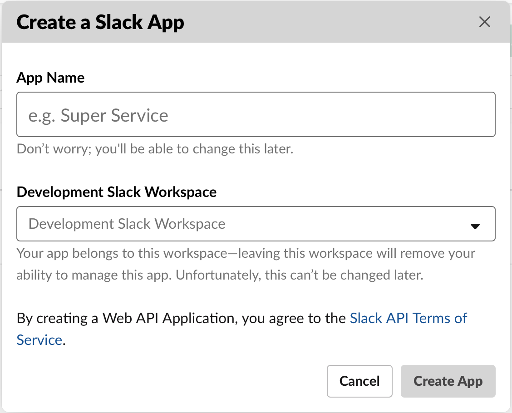

Input the `App Name` and select the `Workspace` you will use the Slack App. After that, click `Create App` button

## Configure AWS intergrate with Slack Bot

- In app management page, Select `Slash Commands` in left menu and click `Create Slash` command

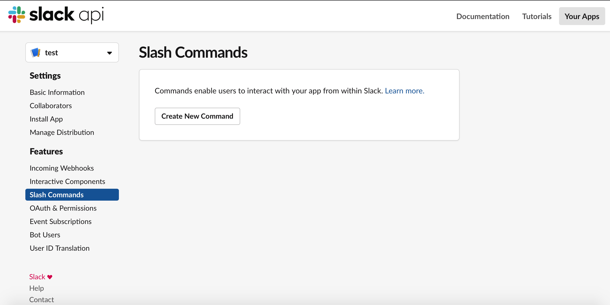

- You will see as below image:

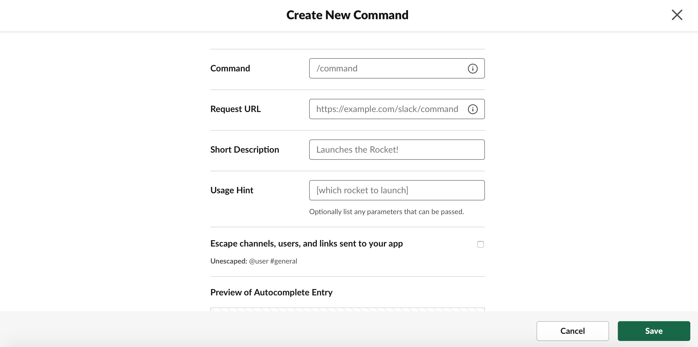

- Input the command like below image:

- The result after create like below:

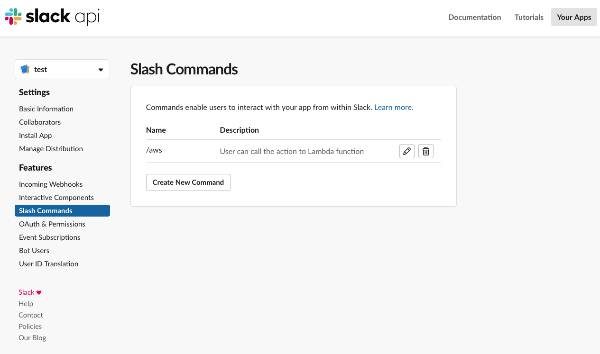

## Install App to Workspace

- In API page click `Install App` in left menu and click to button `Install App to Workspace`

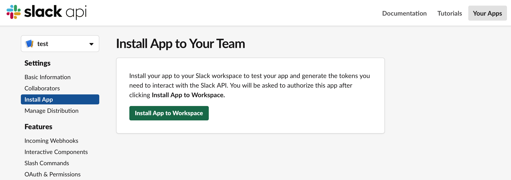

- Click `Install` button to install app to workspace

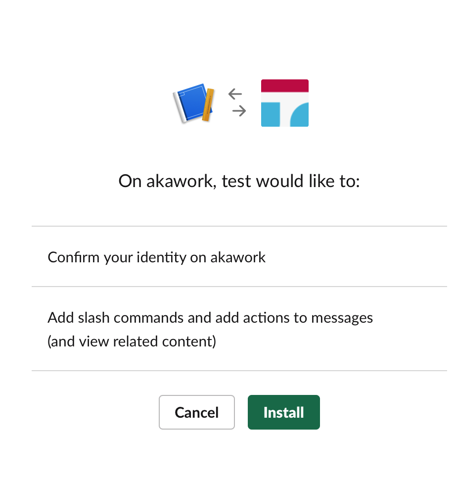

- After that you will see as below:

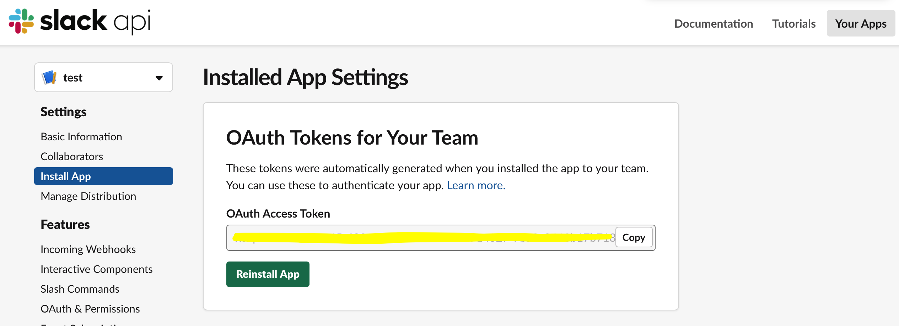

## Create Lambda Functions

- On Lambda page, click `Create function`

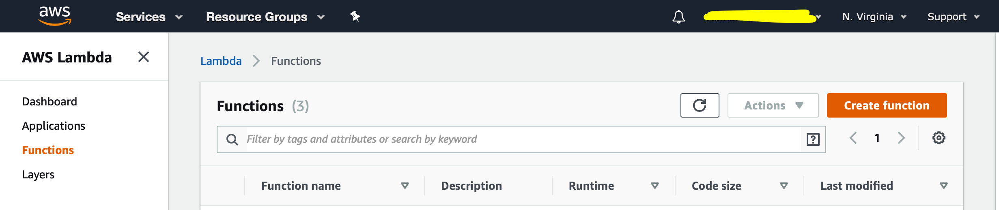

- The page will display as below, you must create an role for lambda function

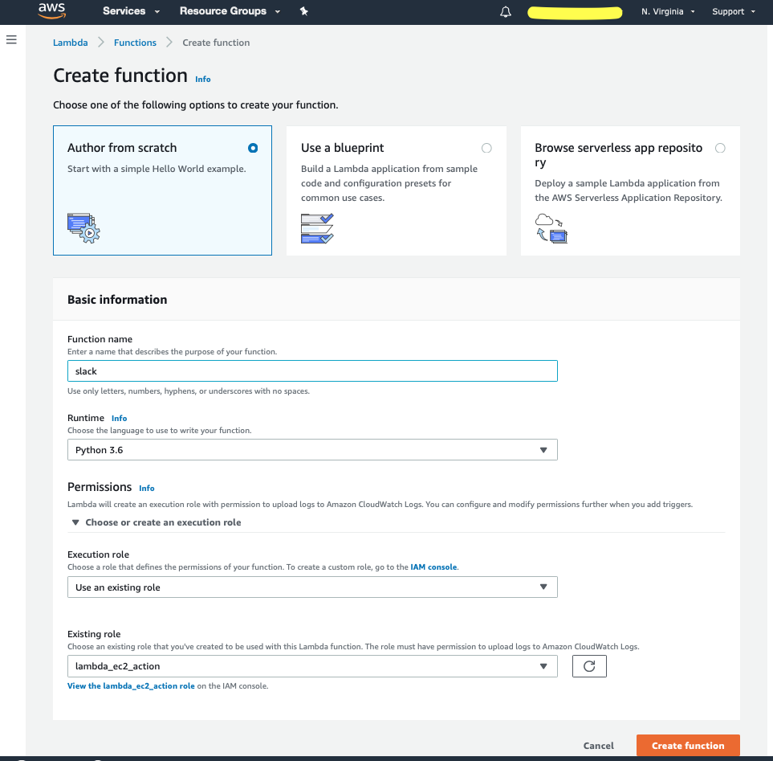

- After create successful you will see the result as below:

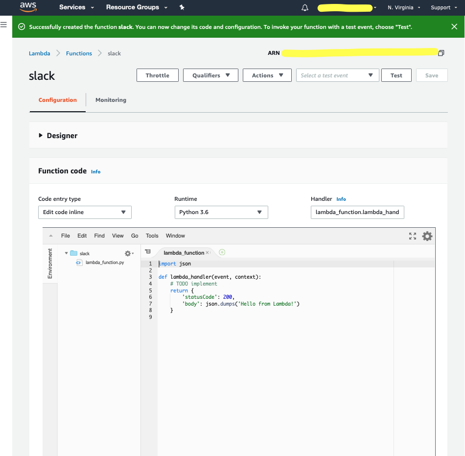

## Create API via API Gateway

- In API Gateway page click to `Create API` button

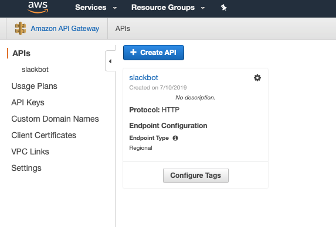

- Input infomation for API and click `Create API` button

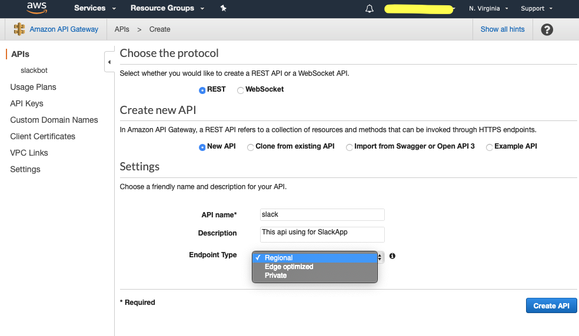

- Create `method` for API by click `Create Method` button as image below

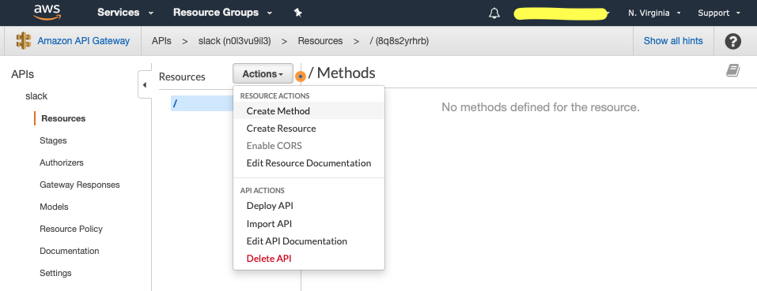

- Select `POST` method

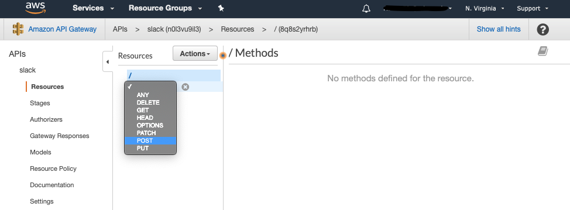

- You will see result as below

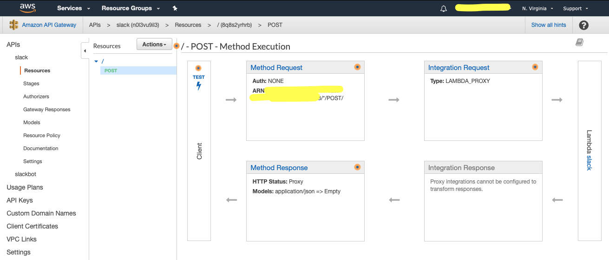

- You can also can see result in the `Design` block from Lambda like below

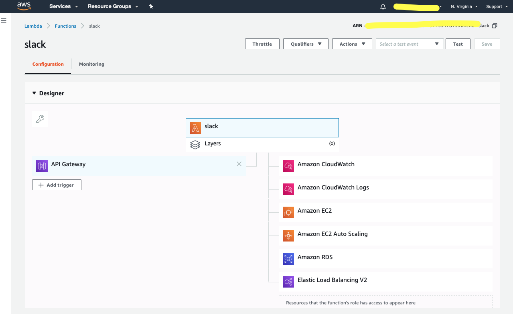

## Develop function

### Requirement

- Python 3.6
- AWS CLI
